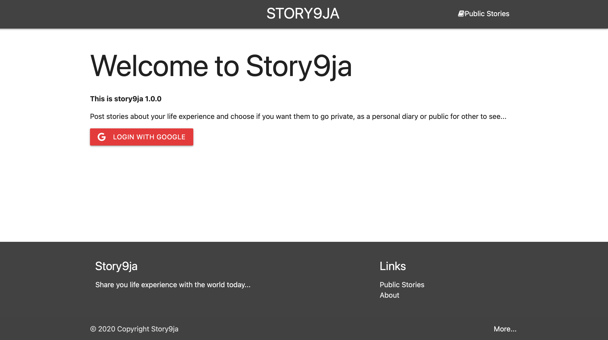

# An Experience management application

This is Story app, an experience management application that allow user to write about an encounter or experience; On posting it to the sory board, other users can read through it; You can either make a story public or private for it not to appear on the story board; by making it public, other will not see your story.

## Tech Stack

**Client:**  Bootstrap, Handlebars, Css, Javascript

**Server:** Node, Express, MongoDB
**API:** Google Auth

## Application URL
- https://lit-dusk-10614.herokuapp.com

## Screenshots

- This is the hero page: The user first sees this interface on visit to the web app

- This is where the user sees a list of stories that was made public, and they can choose anyone to read through
- 

- This page shows a listing of all the stories posted by a particular user.
- 

